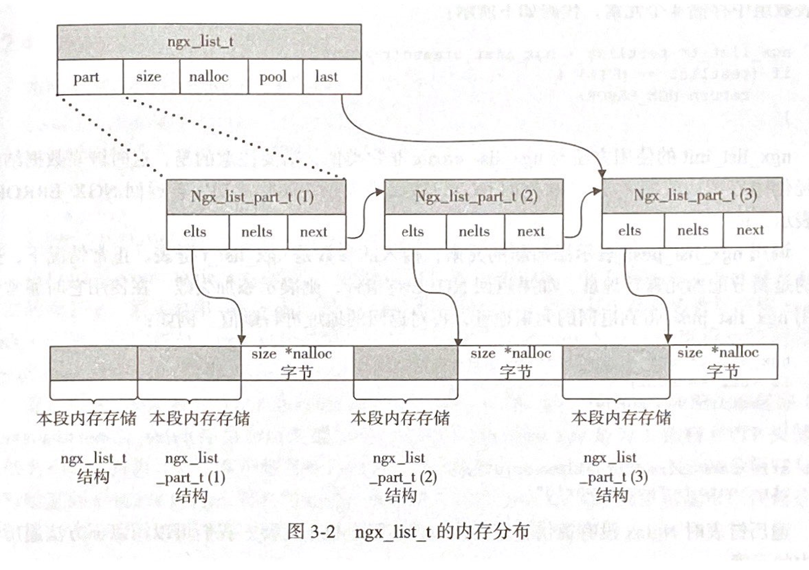
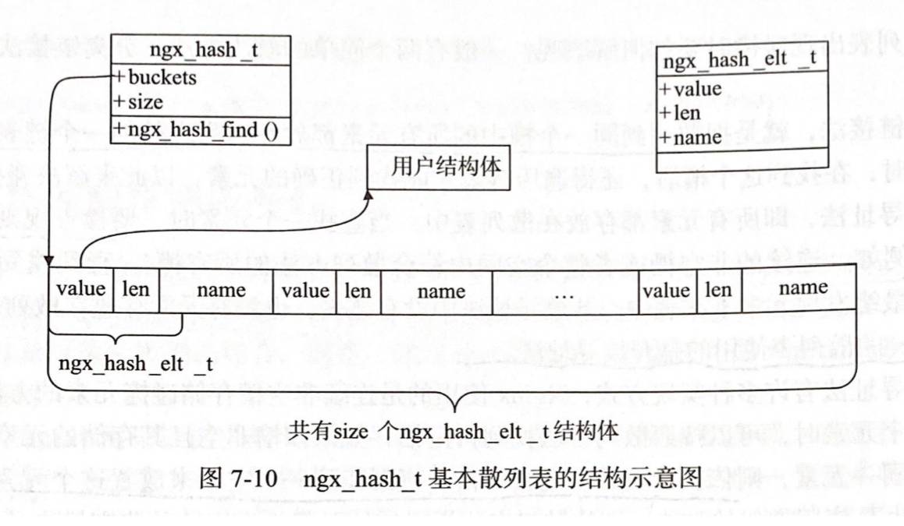

# Chapter 7 - Nginx 提供的高级数据结构

Created by : Mr Dk.

2020 / 07 / 18 15:51

Nanjing, Jiangsu, China

---

这里记录了一些 Nginx 中数据结构的定义和封装。Nginx 对内存分配比较吝啬，以保证高并发，因此这些数据结构天生尽可能较少地占用内存。

## 7.1 整型的封装

Nginx 用 `ngx_int_t` 封装 `int`，使用 `ngx_uint_t` 封装 `unsigned int`。

## 7.2 字符串的封装

在 Nginx 中，将字符串封装为 `ngx_str_t`：

```c
typedef struct {
    size_t len;
    u_char *data;
} ngx_str_t;
```

其中 `data` 指针指向字符串的起始地址，但是字符串不一定以 `\0` 结尾，所以如果把它当作普通字符串使用都将会导致内存越界。因此需要配合长度 `len` 来使用。

## 7.3 单向链表的封装

`ngx_list_t` 在 Nginx 中使用得很频繁，比如用于存储 HTTP header。其定义如下：

```c
typedef struct ngx_list_part_s ngx_list_part_t;
struct ngx_list_part_s {
    void *elts;
    ngx_uint_t nelts;
    ngx_list_part_t *next;
};

typedef struct {
    ngx_list_part_t *last;
    ngx_list_part_t part;
    size_t size;
    ngx_uint_t nalloc;
    ngx_pool_t *pool;
} ngx_list_t;
```

具体实现形式是由一个个链表元素 `ngx_list_part_s` 组成的链表 `ngx_list_t`。其中，每个链表元素中又维护着一段连续的内存 (数组)。这段内存的长度由实际存储元素的大小 `size` 与每个链表元素中可容纳的实际存储元素的个数 `nalloc` 决定 (相乘)。整个链表所占用的内存由 `ngx_pool_t` 类型的内存池分配，通常都是连续的内存。内存组织形式如下图：



这种设计的优势：

* 链表中存储的元素比较灵活 (因为 `size` 可以在链表创建时任意指定)
* ...?

创建链表时，需要在参数中传入内存池对象指针。

* `ngx_list_create()` - 创建新的链表
* `ngx_list_init()` - 初始化一个已有链表
* `ngx_list_push()` - 添加新的元素
* 遍历链表不需要特定接口，可以直接根据上图中的数据结构完成

## 7.4 双向链表

链表的优势在于，能够高效执行 **插入、删除、合并** 的操作。因为只需要修改指针的指向即可，很适合频繁修改容器的场合。Nginx 中的 `ngx_queue_t` 双向链表有以下特性：

* 实现了排序
* 不负责链表元素所占内存的分配
* 支持两个链表的合并

双向链表的实现只使用了一个数据结构：

```c
typedef struct ngx_queue_s ngx_queue_t;

struct ngx_queue_s {
    ngx_queue_t *prev;
    ngx_queue_t *next;
};
```

使用时，把这个结构体放到链表元素结构体中作为一个 field 即可。对于每个链表元素来说，空间上只增加了两个指针的内存。在向链表中添加、删除元素时，实际上都是对链表元素结构体中的 `ngx_queue_t` 结构体进行修改。

在链表元素结构体中，`ngx_queue_t` 可以在任意一个位置上。通过一个函数，可以获得 `ngx_queue_t` 结构体在包含其本身的结构体中的偏移。这可以用于自行实现双向链表的排序函数：排序函数接收两个 `ngx_queue_t` 结构体作为参数，返回一个 `ngx_int_t` 类型的结果。

通常双向链表初始化时，需要一个独立的 `ngx_queue_t` 作为链表容器结点 (或表头结点)。

由于双向链表的排序算法使用的是插入排序，因此不适合为庞大的数据排序。

## 7.5 动态数组

与 C++ STL 中的 vector 类似，`ngx_array_t` 是一个顺序容器，以数组的形式存储元素，并支持到达数组容量上限时动态改变数组大小。数组的优势在于访问速度 (常量级时间复杂度)，但其大小直接决定了消耗的内存。当数组大小无法确定时，动态数组就有了用武之地。

```c
typedef struct ngx_array_s ngx_array_t;

struct ngx_array_s {
    void *elts; // 数组首地址
    ngx_uint_t nelts; // 数组中已有元素个数
    size_t size; // 数组元素占用内存的大小
    ngx_uint_t nalloc; // 数组容量
    
    ngx_pool_t *pool; // 内存池
}
```

向动态数组中添加新元素时，最好调用 `ngx_array_push()` 或 `ngx_array_push_n()` 函数，它们会在到达数组预分配容量上限时自动扩容。每次扩容受制于以下两种情况：

1. 如果内存池中剩余空间大于等于本次需要新增的空间 (1 或 n)，那么直接扩充 (1 或 n)
2. 如果内存池剩余空间小于本次需要新增的空间
   * 对 `ngx_array_push()` 来说，会将原先的数组扩容一倍
   * 对 `ngx_array_push_n()` 来说
     * 如果 n 小于原先数组的容量，那么扩容一倍
     * 如果 n 大于原先数组的容量，那么扩容到 2 * n 的容量

这里体现了 Nginx 预估用户行为的设计思想。另外，对于内存池中的剩余空间不够的扩容，新扩容的动态数组将位于新的内存块上，这里牵扯到数据的复制，可能会耗时较长。

## 7.6 红黑树

顺序容器的检索效率较差。当需要容器的检索速度很快，或支持 **范围查询** 时，`ngx_rbtree_t` 红黑树是一个不错的选择。红黑树是一棵 **自平衡的二叉查找树**，拥有以下特性：

1. 结点是红色或黑色的
2. 根结点是黑色
3. 所有叶子结点都是黑色的
4. 每个红色结点的两个子结点都是黑色的
5. 任一结点到每个叶子结点的所有简单路径上都包含数量相同的黑色结点

因此红黑树具有关键性质：从根结点出发，到达叶子结点的最长路径，不超过最短路径的两倍。

Nginx 中红黑树结点的定义：

```c
typedef ngx_uint_t gnx_rbtree_key_t;
typedef struct ngx_rbtree_node_s ngx_rbtree_node_t;

struct ngx_rbtree_node_s {
    ngx_rbtree_key_t key; // 红黑树的 key
    ngx_rbtree_node_t *left; // 左子树
    ngx_rbtree_node_t *right; // 右子树
    ngx_rbtree_node_t *parent; // 父结点
    u_char color; // 红/黑
    u_char data; // 1 字节数据，很少使用
};
```

如果要使用红黑树，一般会把这个结构体放到自定义结构体的第一个成员中，这样该结构体就成为了一个红黑树结点。这样方便用 **强制类型转换** 直接把自定义结构体直接转换到红黑树结构体。

其中，`key` 用于实现红黑树结点的排序。由于红黑树是一个通用数据结构，很多场合下允许不同的结点具有相同的 key。因此，在具体使用时，`key` 相同的结点是被 **新增** 还是 **替换** 由 **向红黑树添加元素的函数指针** `insert` 决定。以下是红黑树的容器定义：

```c
typedef struct ngx_rbtree_s ngx_rbtree_t;

typedef void (*ngx_rbtree_insert_pt) (ngx_rbtree_node_t *root, ngx_rbtree_node_t *node, ngx_rbtree_node_t *sentinel);

struct ngx_rbtree_s {
    ngx_rbtree_node_t *root; // 根节点
    ngx_rbtree_node_t *sentinel; // 指向 NIL
    ngx_rbtree_insert_pt insert; // 添加元素的函数指针
};
```

Nginx 已经帮用户实现了三种添加元素的函数：

* `ngx_rbtree_insert_value()` - 向红黑树中添加数据结点，每个结点的 key 必须唯一

* `ngx_rbtree_insert_timer_value()` - 向红黑树中添加结点，每个结点的 key 表示时间或时间差

* `ngx_str_rbtree_insert_value()` - 第一排序依据依然为 key，第二排序依据为结点字符串，因此结点结构体必须为：

  ```c
  typedef struct {
      ngx_rbtree_node_t node;
      ngx_str_t str;
  } ngx_str_node_t;
  ```

另外，自行定义添加元素的函数 `insert()` 也很简单，其处理的主要问题就是当 key 相同时，以何种标准来确定红黑树结点的唯一性。

## 7.7 基数树

基数树也是一种二叉查找树，要求每个结点都以 32-bit 整型数作为结点的唯一标识，按整型数的二进制位来建树。从最高位开始，遇到 0 进入左子树，遇到 1 进入右子树。因此 `ngx_radix_tree_t` 的最大深度为 32。为了减少树的高度，基数树引入了掩码的概念，用 0 将整型数的低位掩盖，只留下高位用于建树。掩码中 1 的个数决定了树的深度。

基数树的优点是操作速度快 (检索、插入、删除、范围查询)，但不需要进行旋转自平衡 (因为树高是确定的)。

基数树的内存与用户自定义的内存分离，因此需要负责分配每个树结点的内存：

```c
typedef struct ngx_radix_node_s ngx_radix_node_t;

struct ngx_radix_node_s {
    ngx_radix_node_t *right; // 右子树
    ngx_radix_node_t *left; // 左子树
    ngx_radix_node_t *parent; // 父结点
    uintptr_t value; // 指向用户定义的数据结构
};
```

由基数树容器来管理所有的树结点内存：

```c
typedef struct {
    ngx_radix_node_t *root; // 根结点
    ngx_pool_t *pool; // 内存池
    ngx_redix_node_t *free; // 已分配但未使用的空闲结点单链表
    char *start; // 已分配内存中还未使用的内存首地址
    size_t size; // 已分配内存中还未使用的内存大小
};
```

在分配内存时，优先从 `free` 中寻找已经分配的内存，如果没有，再从 `pool` 中分配新的结点。

## 7.8 支持通配符的散列表

Hash 表的理论检索、插入复杂度为 O(1)。在 Nginx 中，各种 hash 表的 key 以 **字符串** 为主。Nginx 封装了 hash 表容器，以支持主机名称的前通配符和后通配符。

既然是 hash 表就一定会有碰撞，解决碰撞的方式有很多种。Nginx 采用 *开放寻址法*，如果发现冲突，则依次检查其后的每一个槽，直到找到一个空槽来存放这个元素。每一个槽的结构定义如下：

```c
typedef struct {
    void *value; // 指向用户定义的数据
    u_short len; // 元素 key 长度
    u_char name[1]; // 元素 key 首地址
} ngx_hash_elt_t;
```

当然，一个槽的实际大小并不等于上述结构体的大小，因为 key 的长度是可变的。其实际大小是在初始化 hash 表时决定的：

```c
typedef struct {
    ngx_hash_elt_t **buckets; // 指向第一个槽的首地址
    ngx_uint_t size; // 槽的总数
} ngx_hash_t;
```

其内存示意图如下：



Nginx 定义了计算 hash 值的函数指针，允许用户自行实现通过 key 计算出 hash 值的行为。传入的参数为 key 的首地址与长度，返回值为 `ngx_uint_t` 类型的 hash 值。

```c
typedef ngx_uint_t (*ngx_hash_key_pt) (u_char *data, size_t len);
```

Nginx 自身提供了两种基本的 hash 计算方法，假定了 key 是字符串：

* `ngx_hash_key` - 使用 [*BKDR*](https://zhuanlan.zhihu.com/p/25855753) 算法将任意长度的字符串映射为整型
* `ngx_hash_key_lc` - 将字符串全部转换为小写，再使用 BKDR 算法

### 7.8.1 支持通配符

Nginx 中，hash 表的 key 经常是 URI 域名，有的域名中包含前置或后置的通配符。Nginx 会将域名中去除通配符后的字符串保存在专门的前置或后置通配符的 hash 表中，并使用专门的方法检索前置或后置通配符。

* 对 `www.test.*`，后置通配符 hash 表中存储的 key 为 `www.test.`
* 对 `*.test.com`，前置通配符 hash 表中存储的 key 为 `com.test.`

Nginx 中对普通的 hash 表做了一层简单的封装，以支持前置或后置通配符：

```c
typedef struct {
    ngx_hash_t hash; // 基本 hash 表
    void *value; // 指向用户数据
} ngx_hash_wildcard_t;
```

与 Nginx 对于主机域名通配符的支持规则相对应，Nginx 实现的通配符 hash 表的定义如下：

```c
typedef struct {
    ngx_hash_t hash; // 精确匹配主机名的 hash 表
    ngx_hash_wildcard_t *wc_head; // 匹配前置通配符的 hash 表
    ngx_hash_wildcard_t *wc_tail; // 匹配后置通配符的 hash 表
} ngx_hash_combined_t;
```

可以看到，用了三个 hash 表来保存所有的主机名。在查询元素时，会依次按照从上到下的顺序查询 hash 表。因此，当一个 key 同时匹配三个 hash 表时，一定会返回精确匹配的 hash 表中的元素。三个 hash 表本身由动态数组实现。

---

