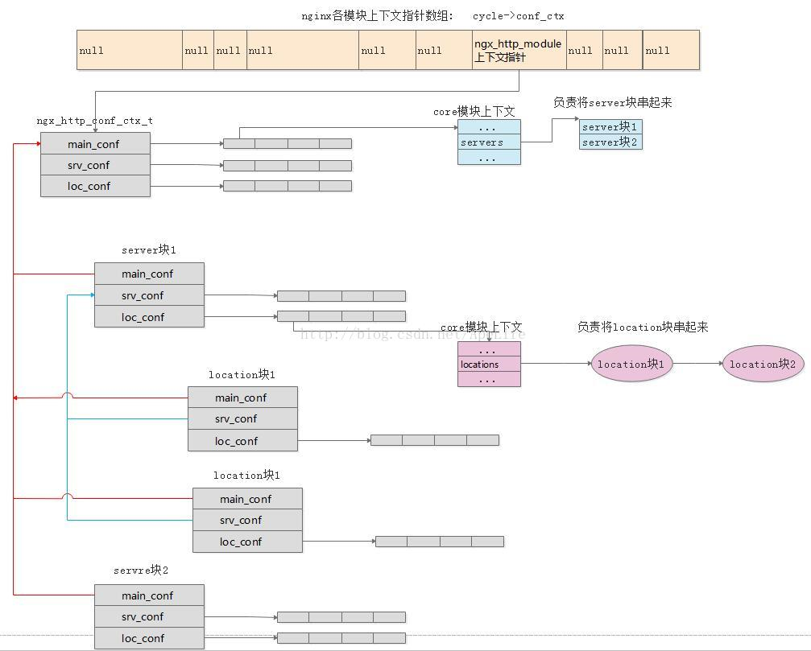

# Chapter 10.1-10.2 - HTTP 框架的配置解析与合并

Created by : Mr Dk.

2020 / 07 / 28 20:08

Nanjing, Jiangsu, China

---

## 10.1 HTTP 框架概述

在 Nginx 中，HTTP 框架是事件消费模块的大户。HTTP 框架要完成的基础性工作包含：

1. 处理 `http{}` 块内的配置项
2. 监听 Web 端口，处理新连接事件、可读事件、可写事件
3. 通过状态机，分析接收到的 TCP 字符流是否是完成的 HTTP packet
4. 根据接收到的 HTTP 请求的 URI 和 HTTP header，按请求所在阶段，分发到某个 HTTP 模块，调用其回调函数处理请求
5. 向 HTTP 模块提供必要的工具函数 (处理网络 I/O 和磁盘 I/O)
6. 提供 upstream 机制帮助 HTTP 模块访问第三方服务
7. 提供 subrequest 机制帮助 HTTP 模块实现子请求

一个典型的 HTTP 配置：

```nginx
http {
    ...;
    server {
        ...;
        location /L1 {
            ...;
        }
        location /L2 {
            ...;
        }
    }
    server {
        ...;
        location /L1 {
            ...;
        }
        location /L2 {
            ...;
        }
    }
}
```

可以看到，HTTP 框架支持在一个 `http{}` 块中包含多个 `server{}` 块和多个 `location{}` 块。`ngx_http_module` 核心模块定义了新的模块类型 `NGX_HTTP_MODULE`。这类模块中的 `ctx` 被定义为 `ngx_http_module_t`，是所有 HTTP 模块的通用接口。`ngx_http_module_t` 接口完全围绕着解析配置项来进行。其中包含三类配置项：

* 直接隶属于 `http{}` 块的 main 配置项
* 直接隶属于 `server{}` 块的 srv 配置项
* 直接隶属于 `location{}` 块的 loc 配置项

```c
typedef struct {
    // 解析 http{} 块前后的回调
    ngx_int_t   (*preconfiguration)(ngx_conf_t *cf);
    ngx_int_t   (*postconfiguration)(ngx_conf_t *cf);

    // 创建存储 http{} 中配置项的结构体
    void       *(*create_main_conf)(ngx_conf_t *cf);
    // 解析完 http{} 内 main 配置项的回调
    char       *(*init_main_conf)(ngx_conf_t *cf, void *conf);

    // 创建存储 server{} 中 srv 配置项的结构体
    void       *(*create_srv_conf)(ngx_conf_t *cf);
    // 将 main 中的配置项合并到 srv 中
    char       *(*merge_srv_conf)(ngx_conf_t *cf, void *prev, void *conf);

    // 创建存储 location{} 中 loc 配置项的结构体
    void       *(*create_loc_conf)(ngx_conf_t *cf);
    // 将 main、srv 中的配置项合并到 loc 中
    char       *(*merge_loc_conf)(ngx_conf_t *cf, void *prev, void *conf);
} ngx_http_module_t;
```

---

## 10.2 管理 HTTP 模块的配置项

HTTP 模块配置项的复杂性。HTTP 模块有三种等级的配置项，对于 HTTP 模块而言，只需要关心在工作时能够正确取到配置项即可。但对于 HTTP 框架来说，其 server 相关的配置项可能会出现在 main 级别中，location 相关的配置项可能会出现在 main、srv 级别中。所以在解析完配置项后，还要进行 **合并** 操作，把 main 级别、srv 级别的配置项合并到 loc 级别配置项中。具体的合并行为也可以通过实现 `ngx_http_module_t` 中的 `merge()` 函数自行定义行为。

具体涉及到数据结构的组织非常复杂。在 [CSDN](https://blog.csdn.net/apelife/article/details/53574273) 上盗了个图，不想贴代码了：



首先是存储配置项的结构体定义。这个结构体会被 **每一个 HTTP 模块** 解析 **每一个等级的配置项** 时建立：

```c
typedef struct {
    void        **main_conf;
    void        **srv_conf;
    void        **loc_conf;
} ngx_http_conf_ctx_t;
```

在解析到 `http{}` 块的 main 级别配置项时，会分别调用每个 HTTP 模块的 `create_main_conf()`、`create_srv_conf()`、`create_loc_conf()` 函数，通过这个结构体，建立属于 `http{}` 块的配置项。

在解析到 `server{}` 块时，则回调 `ngx_http_core_server()`，开始解析 srv 级别的配置项。同样也会建立属于这个 `server{}` 块的 `ngx_http_conf_ctx_t` 结构体。其中，`main_conf` 指针指向所属 `http{}` 块的 `main_conf`，而 `srv_conf` 和 `loc_conf` 都会重新分配数组，并依次调用所有 HTTP 模块的 `create_srv_conf()` 函数和 `create_loc_conf()` 函数。

在解析到 `location{}` 块时，回调 `ngx_http_core_location()`，开始解析 loc 级别的配置项。同样这里也会建立属于 `location{}` 块的 `ngx_http_conf_ctx_t` 结构体，其中 `main_conf` 和 `srv_conf` 分别指向所属 `server{}` 块的 `main_conf` 和 `srv_conf`。而 `loc_conf` 则将会重新分配指针数组，并依次调用所有 HTTP 模块的 `create_loc_conf()` 函数。

可以看到，`create_loc_conf()` 被三个等级的配置项分别调用了一次，它们都可以被合并到 loc 级别的配置中；`create_srv_conf()` 被两个等级的配置项分别调用了一次，它们都可以被合并到 srv 级别的配置中。

首先进行的是 main 级别与 srv 级别的同名配置的合并 (节选自 `ngx_http_block()` 函数)：

```c
/*
 * init http{} main_conf's, merge the server{}s' srv_conf's
 * and its location{}s' loc_conf's
 */

cmcf = ctx->main_conf[ngx_http_core_module.ctx_index];
cscfp = cmcf->servers.elts;

// 遍历所有 Nginx 模块
for (m = 0; cf->cycle->modules[m]; m++) {
    // HTTP 类型的模块
    if (cf->cycle->modules[m]->type != NGX_HTTP_MODULE) {
        continue;
    }

    // 获得模块结构体和编号
    module = cf->cycle->modules[m]->ctx;
    mi = cf->cycle->modules[m]->ctx_index;

    /* init http{} main_conf's */

    if (module->init_main_conf) {
        rv = module->init_main_conf(cf, ctx->main_conf[mi]);
        if (rv != NGX_CONF_OK) {
            goto failed;
        }
    }

    // 将 http{} 块中的配置向 server{} 块中合并
    rv = ngx_http_merge_servers(cf, cmcf, module, mi);
    if (rv != NGX_CONF_OK) {
        goto failed;
    }
}
```

`ngx_http_merge_servers()` 函数中，将 `http{}` 块对应的配置结构体中的 `srv_conf` 和 `loc_conf` 合并到 `server{}` 块的 `srv_conf` 和 `loc_conf` 中。

```c
static char *
ngx_http_merge_servers(ngx_conf_t *cf, ngx_http_core_main_conf_t *cmcf,
    ngx_http_module_t *module, ngx_uint_t ctx_index)
{
    char                        *rv;
    ngx_uint_t                   s;
    ngx_http_conf_ctx_t         *ctx, saved;
    ngx_http_core_loc_conf_t    *clcf;
    ngx_http_core_srv_conf_t   **cscfp;

    cscfp = cmcf->servers.elts; // 所有 server{} 块下的配置
    ctx = (ngx_http_conf_ctx_t *) cf->ctx; // http{} 块下的全局配置
    saved = *ctx;
    rv = NGX_CONF_OK;

    // 遍历所有 server 块下的 srv 级别配置
    for (s = 0; s < cmcf->servers.nelts; s++) {

        /* merge the server{}s' srv_conf's */

        ctx->srv_conf = cscfp[s]->ctx->srv_conf;

        // 如果当前 HTTP 模块实现了 http{} 块到 server{} 块的 srv 级别配置的合并函数
        if (module->merge_srv_conf) {
            // 调用合并函数，参数分别为 http{} 块的 srv 配置和 server{} 块的 srv 配置
            rv = module->merge_srv_conf(cf, saved.srv_conf[ctx_index],
                                        cscfp[s]->ctx->srv_conf[ctx_index]);
            if (rv != NGX_CONF_OK) {
                goto failed;
            }
        }

        // 如果当前 HTTP 模块实现了 http{} 块到 server{} 块的 loc 级别配置的合并函数
        if (module->merge_loc_conf) {

            /* merge the server{}'s loc_conf */

            ctx->loc_conf = cscfp[s]->ctx->loc_conf;

            // 调用合并函数，参数分别为 http{} 块的 loc 配置和 server{} 块的 loc 配置
            rv = module->merge_loc_conf(cf, saved.loc_conf[ctx_index],
                                        cscfp[s]->ctx->loc_conf[ctx_index]);
            if (rv != NGX_CONF_OK) {
                goto failed;
            }

            /* merge the locations{}' loc_conf's */

            clcf = cscfp[s]->ctx->loc_conf[ngx_http_core_module.ctx_index];

            // 开始将 server{} 块中的配置向 location{} 块中合并
            rv = ngx_http_merge_locations(cf, clcf->locations,
                                          cscfp[s]->ctx->loc_conf,
                                          module, ctx_index);
            if (rv != NGX_CONF_OK) {
                goto failed;
            }
        }
    }

failed:

    *ctx = saved;

    return rv;
}
```

在 `ngx_http_merge_locations()` 函数中，将 `server{}` 块的 `loc_conf` (此时已经与 `http{}` 块的 `loc_conf` 合并) 与 `location{}` 块的 `loc_conf` 合并：

```c
static char *
ngx_http_merge_locations(ngx_conf_t *cf, ngx_queue_t *locations,
    void **loc_conf, ngx_http_module_t *module, ngx_uint_t ctx_index)
{
    char                       *rv;
    ngx_queue_t                *q;
    ngx_http_conf_ctx_t        *ctx, saved;
    ngx_http_core_loc_conf_t   *clcf;
    ngx_http_location_queue_t  *lq;

    // 当前 server 块下没有 location 块，直接返回
    if (locations == NULL) {
        return NGX_CONF_OK;
    }

    ctx = (ngx_http_conf_ctx_t *) cf->ctx;
    saved = *ctx;

    // 遍历每一个 location 块
    for (q = ngx_queue_head(locations);
         q != ngx_queue_sentinel(locations);
         q = ngx_queue_next(q))
    {
        lq = (ngx_http_location_queue_t *) q;

        clcf = lq->exact ? lq->exact : lq->inclusive;
        ctx->loc_conf = clcf->loc_conf;

        // 合并 server{} 块与 location{} 块的配置项
        rv = module->merge_loc_conf(cf, loc_conf[ctx_index],
                                    clcf->loc_conf[ctx_index]);
        if (rv != NGX_CONF_OK) {
            return rv;
        }

        // location 块可以嵌套 location 块，所以递归
        rv = ngx_http_merge_locations(cf, clcf->locations, clcf->loc_conf,
                                      module, ctx_index);
        if (rv != NGX_CONF_OK) {
            return rv;
        }
    }

    *ctx = saved;

    return NGX_CONF_OK;
}
```

---

## References

[CSDN - Nginx 配置解析之配置合并](https://blog.csdn.net/apelife/article/details/53574273)

---

