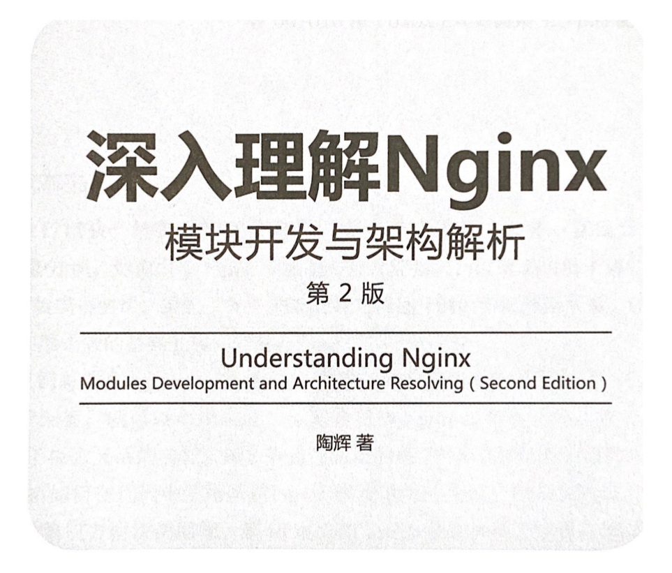

# understanding-nginx-notes
🗜️ Notes of reading *Understanding Nginx*.

Created by : Mr Dk.

2020 / 07 / 16 @Nanjing

---

## About

*Nginx* is famous for its high performance and beautiful architecture design. It makes full use of features provided by operating system and hardware to get better performance.

This repo contains my notes of reading *Understanding Nginx, Modules Development and Architecture Resolving (Second Edition)* by *陶辉*, along with some source code of *Nginx*. The cover of the book is as follows, **please support the legal edition!**

## License

Copyright © 2020, Jingtang Zhang. ([MIT License](LICENSE))

---

